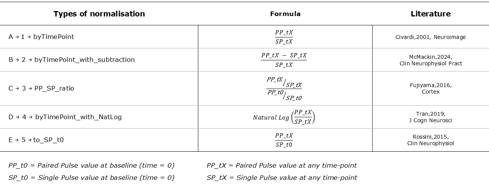
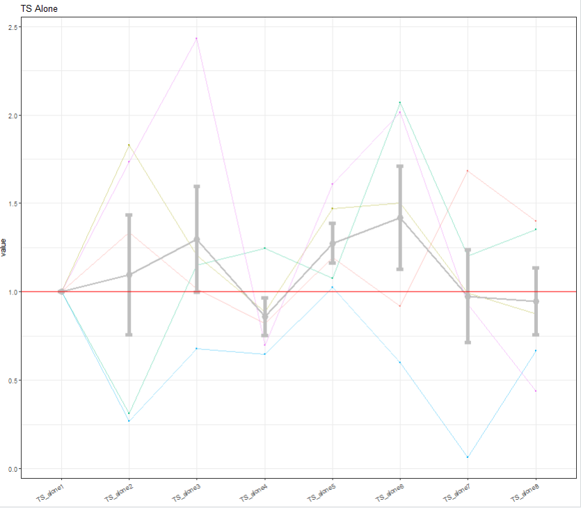
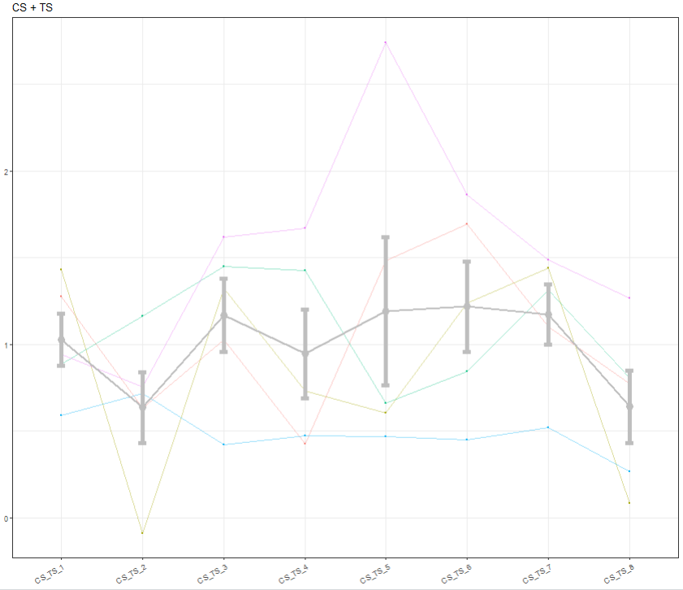
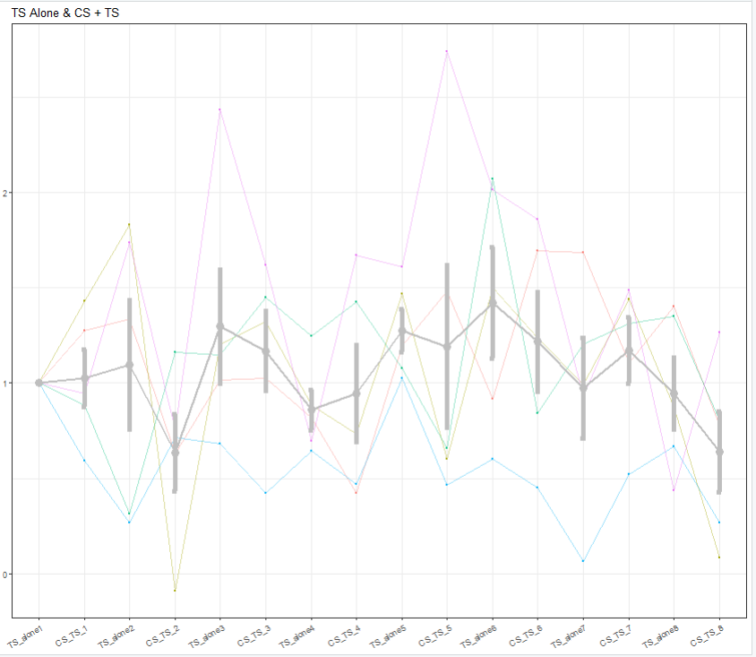
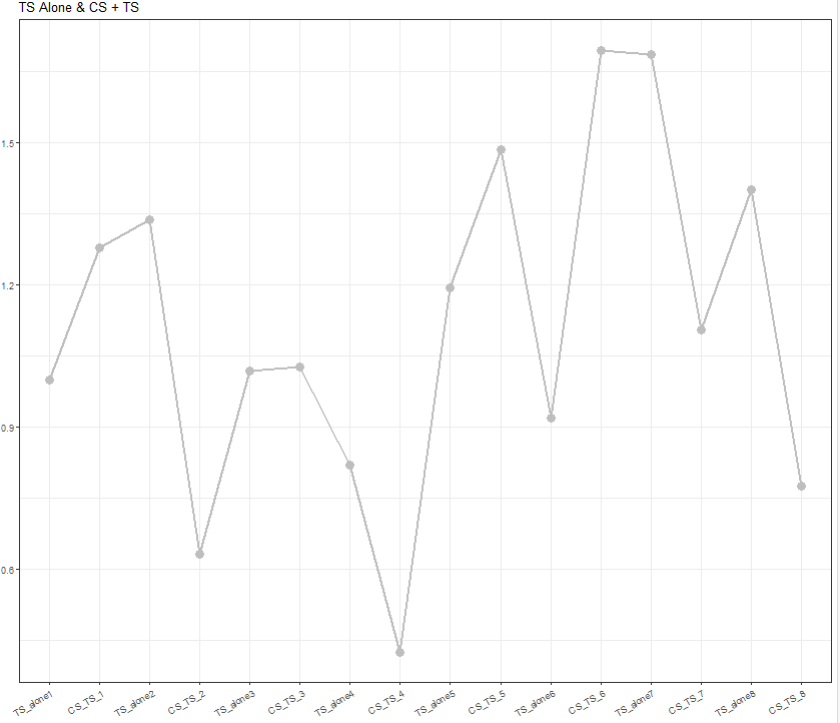

<!-- README.md is generated from README.Rmd. Please edit that file -->

```{r, include = FALSE}
knitr::opts_chunk$set(
  collapse = TRUE,
  comment = "#>",
  fig.path = "man/figures/README-",
  out.width = "100%"
)
```

# PairedPulseTMS 

<!-- badges: start -->
<!-- badges: end -->

This package includes a set of functions to analyse raw paired-pulse TMS data and normalise them

## Installation

You can install the development version of PairedPulseTMS from [GitHub](https://github.com/) with:

```r
# install.packages("pak")
pak::pak("albertooof/PairedPulseTMS")
```

You can also install the development version of PairedPulseTMS from [GitHub](https://github.com/) with:

```r
# install.packages("devtools")
devtools::install_github("albertooof/PairedPulseTMS")
```

## Types of Dataframe expected as input


## Types of normalisation




## Example

Basic examples which show you how to run the code and what output to expect:

```{r example1}

library(PairedPulseTMS)

data_wide <- data.frame(id = 999, t(rnorm(10, mean = 1, sd = 0.1)))
NORMALISE_PP_to_SP(data_wide, format = "Wide", number_of_triggers = 10 , normalise = "C")


 
```


```{r example2}

data_long <- data.frame(value = c(999, rnorm(10, mean = 1, sd = 0.1)))
NORMALISE_PP_to_SP(data_long, format = "Long", number_of_triggers = 10 , normalise = "A")


```


```{r example3}

ID <- LETTERS[1:5]
dataframe_wide <- data.frame(ID = ID, matrix(stats::rnorm(5 * 16, mean = 1, sd = 0.1), nrow = 5, ncol = 16) )
NORMALISE_PP_to_SP_forDataframe(data = dataframe_wide, format = "Wide", number_of_triggers = 16 , normalise = 3)
 

```


```{r example4}

dataframe_long <- as.data.frame(t(dataframe_wide))
NORMALISE_PP_to_SP_forDataframe(data = dataframe_long, format = "Long", number_of_triggers = 16 , normalise = 4)


```


```{r example5}

ID <- LETTERS[1:5]
dataframe_wide <- data.frame(ID = ID, matrix(stats::rnorm(5 * 16, mean = 1, sd = 0.5), nrow = 5, ncol = 16) )
data <- NORMALISE_PP_to_SP_forDataframe(data = dataframe_wide, format = "Wide", number_of_triggers = 16 , normalise = 5)
plots <- plot_data_for_Dataframes(data, format = "Wide", col_line = "grey", col_dots = "grey", error_measure = "se")


```


```{r example6, eval=FALSE}

plot1 <- plots$plot1
plot1 + ggplot2::geom_hline(yintercept = 1, col = "red")


```



```{r example7, eval=FALSE}

plots$plot2


```



```{r example8 , eval=FALSE}

plots$plot3


```



The plotting function can also take dataframes with only one ID
```{r example9 }

data_wide <- data[1, ]
plots <- plot_data_for_Dataframes(data_wide, format = "Wide", col_line = "grey", col_dots = "grey", error_measure = "se")

```

```{r example10 , eval=FALSE}

plots$plot3

```



